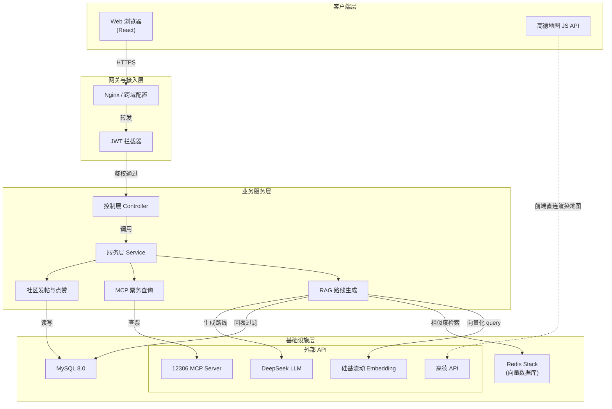
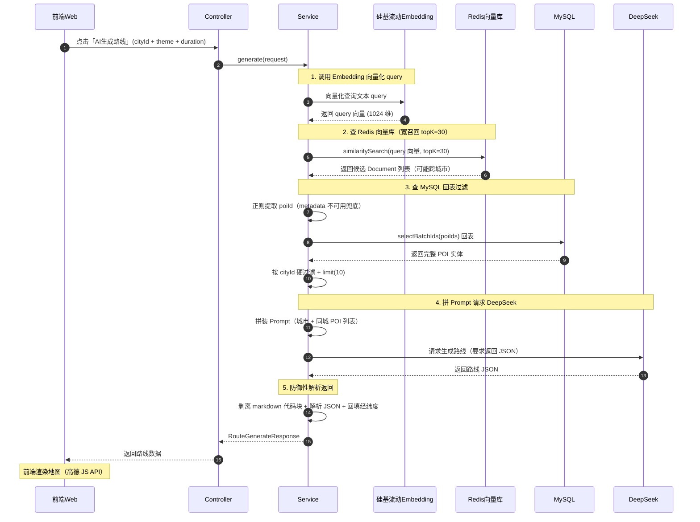

# 架构图

> 本文件集中存放项目架构图，使用 Mermaid 语法，可在 GitHub / Hexo 中直接渲染。

## 一、系统整体架构图（顶层视角）

```mermaid
graph TD
    subgraph L1["客户端层"]
        Browser["Web 浏览器<br/>(React)"]
        AmapJS["高德地图 JS API"]
    end

    subgraph L2["网关与接入层"]
        Nginx["Nginx / 跨域配置"]
        JWT["JWT 拦截器"]
    end

    subgraph L3["业务服务层"]
        Controller["控制层 Controller"]
        ServiceLayer["服务层 Service"]
        RAG["RAG 路线生成"]
        MCP["MCP 票务查询"]
        Community["社区发帖与点赞"]
    end

    subgraph L4["基础设施层"]
        MySQL["MySQL 8.0"]
        Redis["Redis Stack<br/>(向量数据库)"]
        subgraph L5["外部 API"]
            DeepSeek["DeepSeek LLM"]
            Embedding["硅基流动 Embedding"]
            AmapAPI["高德 API"]
            MCP12306["12306 MCP Server"]
        end
    end

    Browser -->|"HTTPS"| Nginx
    AmapJS -.->|"前端直连渲染地图"| AmapAPI
    Nginx -->|"转发"| JWT
    JWT -->|"鉴权通过"| Controller
    Controller -->|"调用"| ServiceLayer

    ServiceLayer --> RAG
    ServiceLayer --> MCP
    ServiceLayer --> Community

    RAG -->|"向量化 query"| Embedding
    RAG -->|"相似度检索"| Redis
    RAG -->|"回表过滤"| MySQL
    RAG -->|"生成路线"| DeepSeek
    MCP -->|"查票"| MCP12306
    Community -->|"读写"| MySQL
```

## 二、核心业务时序图：AI 生成路线

```mermaid
sequenceDiagram
    autonumber
    participant FE as 前端Web
    participant C as Controller
    participant S as Service
    participant EM as 硅基流动Embedding
    participant RD as Redis向量库
    participant DB as MySQL
    participant LLM as DeepSeek

    FE->>C: 点击「AI生成路线」(cityId + theme + duration)
    C->>S: generate(request)

    Note over S,EM: 1. 调用 Embedding 向量化 query
    S->>EM: 向量化查询文本 query
    EM-->>S: 返回 query 向量 (1024 维)

    Note over S,RD: 2. 查 Redis 向量库（宽召回 topK=30）
    S->>RD: similaritySearch(query 向量, topK=30)
    RD-->>S: 返回候选 Document 列表（可能跨城市）

    Note over S,DB: 3. 查 MySQL 回表过滤
    S->>S: 正则提取 poiId（metadata 不可用兜底）
    S->>DB: selectBatchIds(poiIds) 回表
    DB-->>S: 返回完整 POI 实体
    S->>S: 按 cityId 硬过滤 + limit(10)

    Note over S,LLM: 4. 拼 Prompt 请求 DeepSeek
    S->>S: 拼装 Prompt（城市 + 同城 POI 列表）
    S->>LLM: 请求生成路线（要求返回 JSON）
    LLM-->>S: 返回路线 JSON

    Note over S: 5. 防御性解析返回
    S->>S: 剥离 markdown 代码块 + 解析 JSON + 回填经纬度

    S-->>C: RouteGenerateResponse
    C-->>FE: 返回路线数据
    Note over FE: 前端渲染地图（高德 JS API）
```
