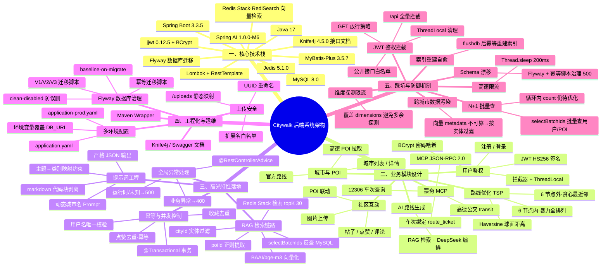

# Citywalk 后端系统思维导图

> 基于项目真实代码整理，从「核心技术栈 / 业务模块设计 / 高光特性落地 / 工程化与运维 / 踩坑与防御机制」5 个维度展开。

```mermaid
mindmap
  root((Citywalk 后端系统架构))
    一、核心技术栈
      Java 17
      Spring Boot 3.3.5
      Spring AI 1.0.0-M6
      MyBatis-Plus 3.5.7
      MySQL 8.0
      Redis Stack·RediSearch 向量检索
      Flyway 数据库迁移
      Knife4j 4.5.0 接口文档
      jjwt 0.12.5 + BCrypt
      Jedis 5.1.0
      Lombok + RestTemplate
    二、业务模块设计
      用户鉴权
        注册 / 登录
        BCrypt 密码哈希
        JWT HS256 签名
        拦截器 + ThreadLocal
      城市与 POI
        城市列表 / 详情
        高德 POI 拉取
        官方路线
      路线优化 TSP
        Haversine 球面距离
        6 节点内·暴力全排列
        6 节点外·贪心最近邻
      AI 路线生成
        RAG 检索 + DeepSeek 编排
      社区互动
        帖子 / 点赞 / 评论
        图片上传
        POI 联动
      票务 MCP
        MCP JSON-RPC 2.0
        12306 车次查询
        高德公交 transit
        车次绑定 route_ticket
    三、高光特性落地
      RAG 检索链路
        BAAI/bge-m3 向量化
        Redis Stack 检索 topK 30
        poiId 正则提取
        selectBatchIds 反查 MySQL
        cityId 实体过滤
      提示词工程
        动态城市名 Prompt
        主题→类别映射约束
        严格 JSON 输出
        markdown 代码块剥离
      幂等与并发控制
        点赞去重·幂等
        收藏去重
        用户名唯一校验
        @Transactional 事务
      全局异常处理
        @RestControllerAdvice
        业务异常→400
        运行时/未知→500
    四、工程化与运维
      Flyway 数据库治理
        V1/V2/V3 迁移脚本
        baseline-on-migrate
        clean-disabled 防误删
        幂等迁移脚本
      多环境配置
        application.yaml
        application-prod.yaml
        环境变量覆盖 DB_URL
      Knife4j / Swagger 文档
      上传安全
        扩展名白名单
        UUID 重命名
        /uploads 静态映射
      Maven Wrapper
    五、踩坑与防御机制
      JWT 鉴权拦截
        /api 全量拦截
        公开接口白名单
        GET 放行策略
        ThreadLocal 清理
      N+1 批量查
        selectBatchIds 批量查用户/POI
        循环内 count 仍待优化
      索引重建自愈
        flushdb 后幂等重建索引
      维度探测限流
        覆盖 dimensions 避免多余探测
      跨城市数据污染
        向量 metadata 不可靠→按实体过滤
      高德限流
        Thread.sleep 200ms
      Schema 漂移
        Flyway + 幂等脚本治理 500
```
